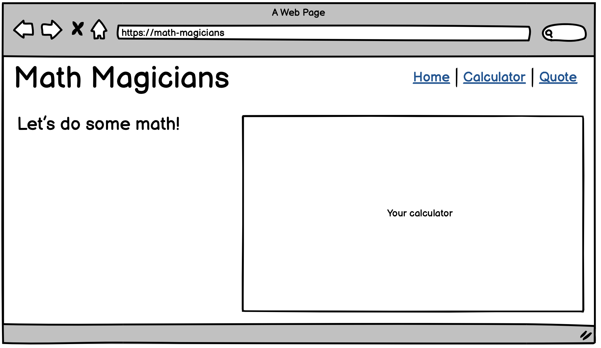

# Sneak peek: Math magicians React Project Overall
## Table of Content
- [Learning-Objective](#learning-objectives)
- [Description](#description)
- [How-To-Build-it](#how-to-build)
- [Clone-the-repo](#clone-the-project)
- [Program](#projects-list)


## Learning objectives
- Understand how to use medium-fidelity wireframes to create a UI.


## Description

"Math magicians" is a website for all fans of mathematics. It is a Single Page App (SPA) that allows users to:
- Make simple calculations.
- Read a random math-related quote.

By building this application, you will learn how to use React.

### How to build

We will start by building the core functionality, which is a calculator. At the very beginning the website will contain only the simple UI presented below, but it will be able to perform all math operations. 

<p align="center">
  
</p>

Once the calculator is ready we will use it as a part of a full website that includes 3 sub-pages:

<p align="center">
  
  
  
</p>

### Clone the project 

To be able to work on the same project or making some review, you should follow these steps below:
- Cloning the repo: 
  open the terminal, and enter this command.
  ````
  git clone git@github.com:Anvi98/math-magicians.git

  ````
- Installing Packages:

  ````
  cd math magicians
  ````
  ````
  yarn build
  ````
  ````
  yarn start
  ````

### Projects list

We will be building your "Math magicians" website for more than a whole week. Here is the list of projects that will guide you through the steps described above. We will find details about each of the project requirements in the upcoming program activities. In some of the projects, we will be working collaboratively by using pair programming.

- Project 1: Setup.
- Project 2: Components.
- Project 3: Events.
- Project 4: Refactor with hooks (pair programming).
- Project 5: Full website.
- Project 6: Tests (pair programming).
- Exercise: Deploy.

------
